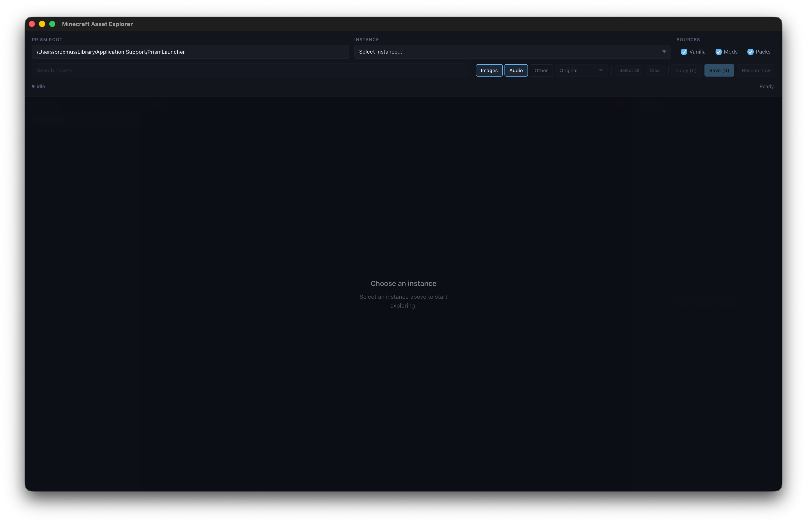

# Minecraft Asset Explorer

Find, preview, and export Minecraft assets from your Prism Launcher instances in one place.



## What You Can Do

- Scan assets from:
  - Vanilla Minecraft
  - Mods
  - Resource packs
- Browse by folder tree or search by name/path
- Preview images, audio, and JSON files
- Select one or many assets
- Copy selected assets directly to your clipboard
- Save selected assets to any folder
- Convert audio on export (`Original`, `MP3`, or `WAV`)

## Quick Start

1. Download the latest app build from [Releases](https://github.com/przxmus/minecraft-asset-explorer/releases/latest).
2. Open the app.
3. In `Prism Root`, set your Prism Launcher root directory.
4. Pick an `Instance`.
5. Keep the sources you want enabled (`Vanilla`, `Mods`, `Packs`).
6. Wait for the first scan to finish, then search, preview, and export assets.

## How To Use

### 1) Pick Your Source Data

- `Prism Root`: the folder that contains your Prism instances
- `Instance`: the exact instance you want to inspect
- `Sources`: choose whether to include vanilla assets, mods, and/or resource packs

The app starts scanning automatically once those are set.
Scan progress is phase-aware (`estimating`, `scanning`) and starts immediately.
After the first full scan, the same modpack config reopens instantly from cache on next app launch.
Cache validation runs in the background (`refreshing`) and updates the index silently when files changed.

### 2) Find Assets Fast

- Use the search box to filter assets
- Narrow by type:
  - `Images`
  - `Audio`
  - `Other`
- Use the left explorer tree to focus on a folder

### 3) Preview Before Exporting

- Click an asset to open preview
- Image files show inline
- Audio files are playable in-app
- JSON and `.mcmeta` files are syntax highlighted

### 4) Export What You Need

- `Copy`: puts selected files on your clipboard
- `Save`: writes selected files into a folder you choose
- `Rescan now`: forces a fresh scan for the current instance/config
- Audio export format is controlled by the format dropdown (`Original` / `MP3` / `WAV`)
- Large export operations show live progress and can be cancelled with `Cancel export`
- Partial failures do not abort the whole export; you get a result panel with failed files
- After `Save`, the destination folder is opened automatically

## Selection Shortcuts

- Click: select one asset
- `Ctrl` / `Cmd` + click: add/remove individual assets
- `Shift` + click: select a range
- `Select all`: select all currently visible results
- `Clear`: remove current selection

## Troubleshooting

### No instances found

Check that `Prism Root` points to your real Prism Launcher data directory.

### Explorer is locked

The explorer stays locked while scanning or until an instance is selected.

### Preview not available

Preview is currently available for images, audio, JSON, and `.mcmeta`.
Other file types can still be copied or saved.

## Optional: Build From Source

If you want to run the app yourself:

```bash
bun install
bun run tauri dev
```

Build release bundles:

```bash
bun run build:all
```

Cross-target notes:

- `build:all` attempts `macos`, `linux`, and `windows` builds from the current machine.
- Cross-compiling requires installed Rust targets plus working linker/toolchain support for each target.
- On non-Linux hosts, Linux builds default to a Docker-based Linux builder image (avoids GTK/WebKit pkg-config cross-compilation issues).
- Install Docker Desktop for Linux builds from macOS/Windows.
- On macOS, the script will try to auto-start OrbStack/Docker Desktop if the daemon is not running.
- Set `BUILD_LINUX_USE_DOCKER=0` to force direct Linux cross-compilation on the host instead of Docker.
- Override default Rust targets per platform with:
  - `TAURI_TARGET_MACOS`
  - `TAURI_TARGET_LINUX`
  - `TAURI_TARGET_WINDOWS`
  (comma-separated for multiple triples)
- On macOS/Linux hosts, Windows builds prefer `x86_64-pc-windows-gnu` by default to avoid MSVC SDK requirements.
- Windows GNU cross-builds on macOS/Linux also require MinGW tools (`dlltool`, `windres`), typically via `brew install mingw-w64`.
- Windows installer bundling also requires NSIS (`makensis`), typically via `brew install nsis`.
- Set `BUILD_AUTO_INSTALL_TOOLCHAINS=1` to let the build script auto-install missing MinGW/NSIS tools with Homebrew.
